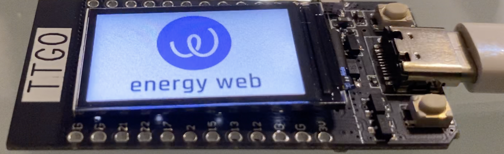
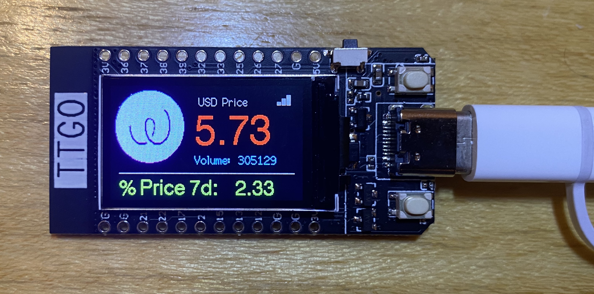

# EnergyWebToken (EWT) Price Ticker Display

<short about text>
EnergyWebToken (EWT) Price Ticker that runs on $6 IoT development board and displays realtime informationn from CinMarketCap such as price, volume and changes. This library does not require an API key due to hacing an embedded CoinMarketCap root certificate and consuming secured HTTPS RESTful APIs<br />

Runs on a perfect low-cost, low-powered IoT development board: TTGO T-Display (ESP32 microprocessor based board with Wifi, Bluetooth and 1.4" LCD Display)<br />




## Maintainers
**Primary**: Mani Hagh Sefat (@manihagh)


## Installation
1. ### Install Dependencies:
+ [TFT_eSPI](https://github.com/Bodmer/TFT_eSPI)
+ [ArduinoJSON](https://github.com/bblanchon/ArduinoJson)

2. ### Configure TFT_eSPI settings:
In TFT_eSPI/User_Setup_Select.h, comment out the default settings #include <User_Setup.h> , select #include <User_Setups/Setup25_TTGO_T_Display.h>, and save your changes.

3. ### Configure your Wifi AP:
Open EWT-Ticker-TTGO-T-Display.ino and modify below two lines with your wifi SSID and password
```
#define wifi_ssid "YOUR-WIFI-SSID"
#define wifi_password "YOUR-WIFI-PASSWORD"
```
4. ### Compile and Upload to device:
Compile the library and upload into your TTGO T-Display using ArduinoIDE


### Prerequisites
+ [ArduinoIDE](https://www.arduino.cc/en/main/software)
+ [TTGO T-Display Board](https://www.aliexpress.com/item/33048962331.html?spm=a2g0o.productlist.0.0.3c4e4e4bNAUURY&algo_pvid=83d9fb7a-c19e-4ab4-be7a-a1ea66d05162&algo_expid=83d9fb7a-c19e-4ab4-be7a-a1ea66d05162-9&btsid=0be3743615939674867663272e8cfb&ws_ab_test=searchweb0_0,searchweb201602_,searchweb201603_)


## Contributing

Please read [CONTRIBUTING.md](https://gist.github.com/PurpleBooth/b24679402957c63ec426) for details on our code of conduct, and the process for submitting pull requests to us.

## License

This project is licensed under the GNU General Public License v3.0 or later - see the [LICENSE](LICENSE) file for details

## FAQ

Frequently asked questions and their answers will be collected here.
